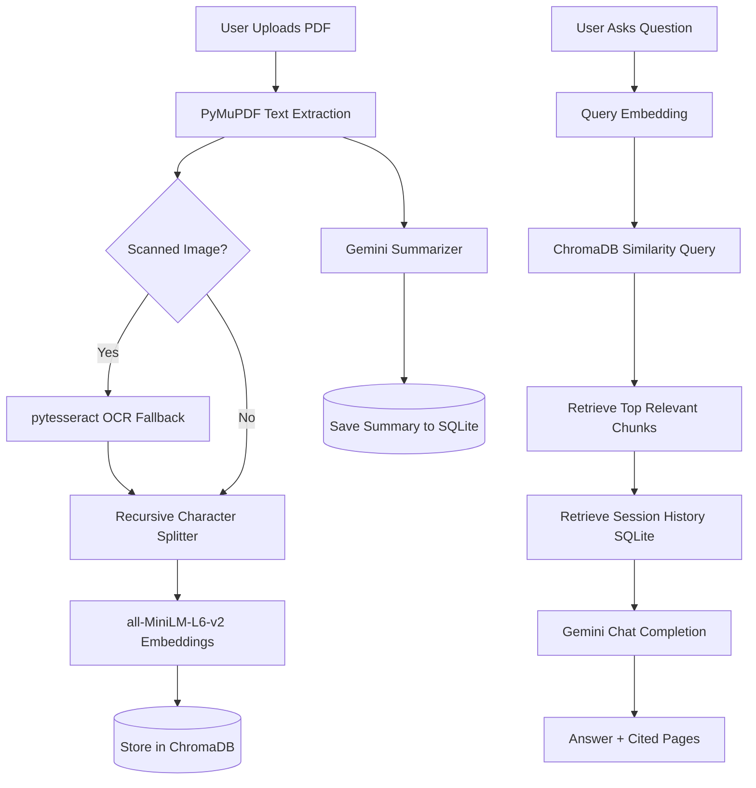

# AI Document Analyzer using RAG

A premium full-stack AI application that extracts text from multiple PDF documents, segments pages, generates vector embeddings, stores them in ChromaDB, and allows users to interact with files using Retrieval-Augmented Generation (RAG) powered by Google Gemini, with a local heuristic fallback. It also features an AI summary dashboard (executive summary, findings, dates) and side-by-side document comparison.

---

## Key Features

1. **PDF Upload & Storage**: Upload multiple files to a local server.
2. **Page-Level Chunking**: Texts are split page-by-page to guarantee citations point to precise page numbers.
3. **Local Embedding Generation**: Uses `sentence-transformers/all-MiniLM-L6-v2` locally (no API cost).
4. **Vector DB Storage**: Saves text embeddings and metadata in ChromaDB.
5. **Multi-Document Support**: Restrict search context to selected files or query all documents simultaneously.
6. **Grounded AI Chat**: Strict context-based question answering using Gemini, with an offline heuristic fallback.
7. **Source Citations**: AI answers include collapsible source snippets detailing the document title and page number.
8. **Document Summary Dashboard**: Extract executive summaries, key findings, and important dates automatically.
9. **Side-by-Side Comparison**: Contrast multiple documents side-by-side.
10. **OCR Scanning**: Integrated `pytesseract` fallback for scanned/image-only PDFs.

---

## Technology Stack

* **Frontend**: React (Vite), Axios, Lucide Icons, Vanilla CSS (Glassmorphism layout).
* **Backend**: FastAPI, Uvicorn, SQLite (Metadata / History), PyMuPDF (PDF extraction), LangChain Splitters.
* **Vector DB**: ChromaDB.
* **Embeddings**: Sentence Transformers (`all-MiniLM-L6-v2`).
* **LLM Orchestration**: Google Gen AI SDK (Gemini).

---

## Architecture Diagram



---

## Setup & Running Instructions

### 1. Prerequisites
* **Python**: Python 3.12+ (tested on Python 3.14)
* **Node.js**: Node 18+ (tested on Node 24)
* **Gemini API key** (Optional): Set `GEMINI_API_KEY` to enable Gemini answers and summaries. Without it, the application remains usable with its local heuristic fallback.
* **Tesseract OCR** (Optional, for scanned PDF OCR support): Install Tesseract and ensure `tesseract` is on your system environment path.

### 2. Backend Setup
1. Open a terminal and navigate to the backend folder:
   ```bash
   cd backend
   ```
2. Install Python dependencies:
   ```bash
   python -m pip install -r requirements.txt
   ```
3. Run the development server using Uvicorn:
   ```bash
   python -m uvicorn app.main:app --reload --port 8000
   ```
   The backend API will be available at `http://localhost:8000` (docs: `http://localhost:8000/docs`).

### 3. Frontend Setup
1. Open another terminal and navigate to the frontend folder:
   ```bash
   cd frontend
   ```
2. Install Node packages:
   ```bash
   npm install
   ```
3. Start the Vite React development server:
   ```bash
   npm run dev
   ```
   The web app will run locally at `http://localhost:5173`.
